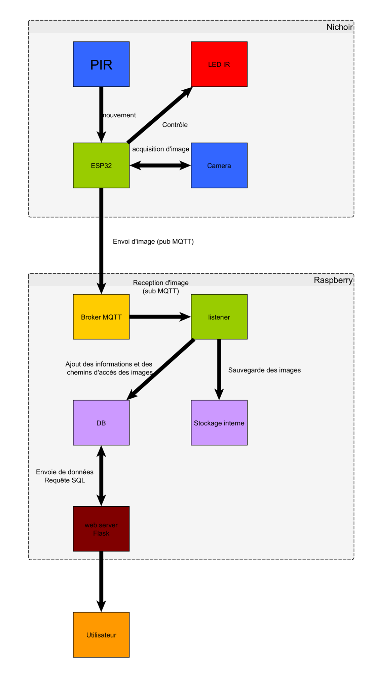

# Projet Nichoir

## Description du projet
L’objectif de ce projet est de concevoir un **nichoir connecté**, capable de surveiller l’activité des oiseaux et de transmettre des informations à distance. Le projet se concentre sur la **performance, l’autonomie et le faible coût**, avec un objectif de prix inférieur à **50 €** et une autonomie comprise entre **6 mois et 1 an**.  

Le projet combine des composants électroniques, un système de transmission de données, ainsi qu’une interface web pour le suivi et la gestion.

---

## Composants imposés

- **TimerCam** : caméra connectée avec fonction timer  
- **Capteur de mouvement PIR (BS612)** : détection de présence dans le nichoir  
- **LED infrarouge** : vision nocturne  

---

## Fonctionnalités du nichoir

### TimerCam
- Détection des mouvements via le capteur PIR  
- Transmission d’images au Raspberry Pi via Wi-Fi  
- Intervalle minimal de **5 minutes entre deux photos**  
- Transmission quotidienne du niveau de batterie, même en absence de mouvement  
- Activation d’un **Access Point** pour permettre la configuration Wi-Fi par l’utilisateur  

### Raspberry Pi (cloud local)
- Réception des informations (photos et niveau de batterie) depuis la TimerCam  
- Stockage des données dans une **base de données**  
- Visualisation des informations via une **interface web** intuitive  

---

## Boîtier et installation
- Un **nichoir est fourni** pour l’accueil des oiseaux  
- Un **boîtier 3D** sera conçu pour protéger et maintenir les composants électroniques à l’intérieur du nichoir  

---

## Objectifs techniques
1. Concevoir un système autonome et durable avec une consommation optimisée  
2. Garantir la fiabilité de la transmission des images et des informations de batterie  
3. Créer une interface web simple et fonctionnelle pour la consultation des données  
4. Assurer une intégration esthétique et sécurisée des composants dans le nichoir

---

## Schéma Bloc Fonctionnel

